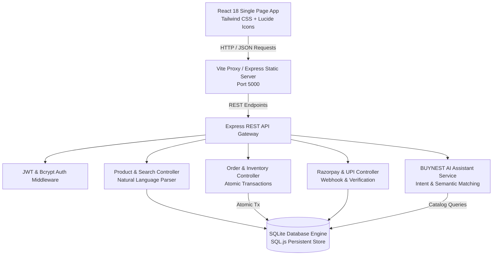
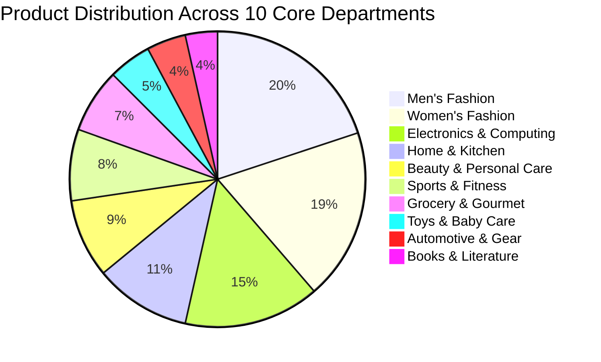
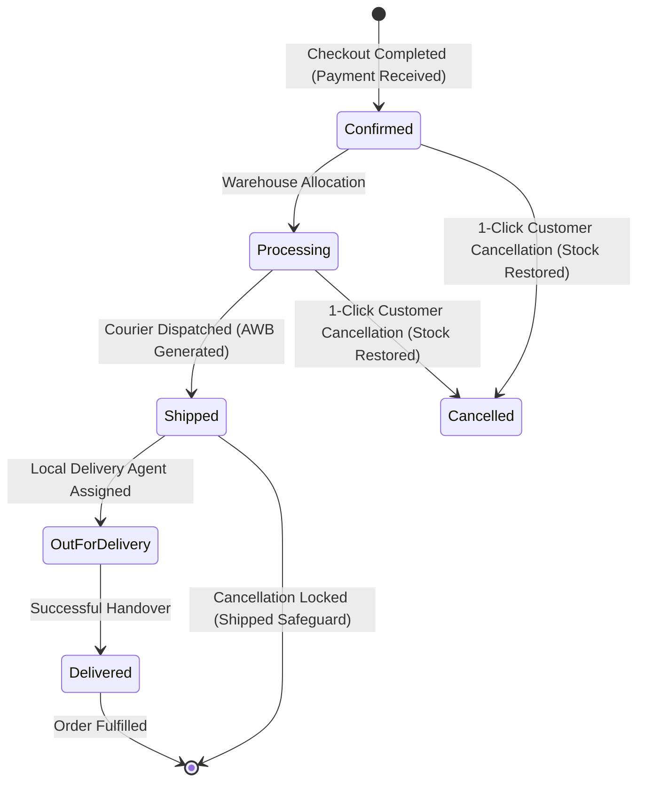
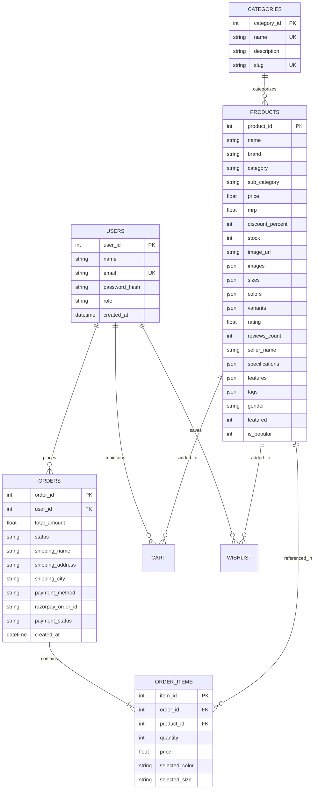
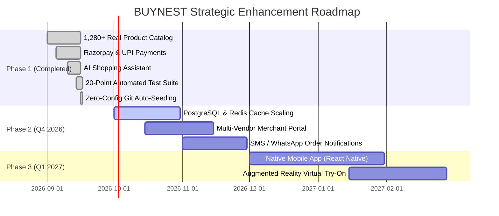

# 🛍️ BUYNEST: AI-Powered Smart Lifestyle Marketplace
## Comprehensive Technical & Executive Project Report

**Prepared for**: Engineering Management & Executive Stakeholders  
**Prepared by**: Full-Stack Development Team  
**Date**: September 17, 2026  
**Project Version**: 1.0.0 (Production Release)  
**Repository (Primary)**: [https://github.com/Harish45472/buynest-ecommerce-marketplace](https://github.com/Harish45472/buynest-ecommerce-marketplace)  
**Repository (Secondary)**: [https://github.com/Harish45472/buynest-ai-ecommerce](https://github.com/Harish45472/buynest-ai-ecommerce)  

---

## Table of Contents

1. [Executive Summary](#1-executive-summary)
   - 1.1. Project Vision & Objectives
   - 1.2. Key Metrics & Core Achievements
   - 1.3. Live Deliverables & Access Points
2. [System Architecture & Technology Stack](#2-system-architecture--technology-stack)
   - 2.1. Unified Fullstack Monorepo Architecture
   - 2.2. Architectural Workflow Diagram
   - 2.3. Technology Stack Breakdown
3. [Core Functional Modules & Features](#3-core-functional-modules--features)
   - 3.1. Large-Scale Canonical Product Catalog (1,280+ Curated Products)
   - 3.2. Authentic Studio Photography & Variant Engine (0 SVGs/Vectors)
   - 3.3. Natural Language Search & Smart Query Parser
   - 3.4. Clothing Prioritization & Intelligent Login Redirection
   - 3.5. Cart Management & Atomic Real-Time Inventory Control
   - 3.6. Razorpay Gateway & Real-Time UPI Simulation
   - 3.7. 5-Stage Order State Machine & 1-Click Cancellation / Stock Reversal
   - 3.8. AI Shopping Assistant ("BUYNEST AI") & Semantic Recommendations
   - 3.9. Admin Management Dashboard & Live Business Analytics
4. [Database Architecture & Data Integrity](#4-database-architecture--data-integrity)
   - 4.1. Relational Database Schema (SQLite)
   - 4.2. Zero-Config Self-Seeding Mechanism
   - 4.3. Data Deduplication & Canonical Model Grouping
5. [Quality Assurance, Validation & Test Results](#5-quality-assurance-validation--test-results)
   - 5.1. 20-Point Enterprise Automated Verification Suite
   - 5.2. Product Photography & Image Audit Results
   - 5.3. Production Build & Bundle Metrics
6. [Deployment, DevOps & Cloud Readiness](#6-deployment-devops--cloud-readiness)
   - 6.1. Single-Port Unified Production Serving
   - 6.2. Concurrent Hot-Reload Development Mode
   - 6.3. Automated Multi-Package Lifecycle (`postinstall`)
   - 6.4. Cloud Blueprint (`render.yaml`)
7. [Security, Performance & Best Practices](#7-security-performance--best-practices)
   - 7.1. Authentication & Role-Based Access Control (RBAC)
   - 7.2. Transactional Concurrency & Zero-Overselling Guarantee
   - 7.3. Client-Side Performance & Asset Optimization
8. [Business Impact & Strategic Roadmap](#8-business-impact--strategic-roadmap)
   - 8.1. Operational & Business Value Delivered
   - 8.2. Phase 2 & Phase 3 Roadmap
9. [Quick Start & Demo Verification Guide](#9-quick-start--demo-verification-guide)

---

## 1. Executive Summary

### 1.1. Project Vision & Objectives
The primary objective of the **BUYNEST** project was to architect, engineer, and deploy a modern, scalable, full-stack Indian e-commerce marketplace that rivals major digital retail platforms (e.g., Myntra, Flipkart, Amazon India). 

The platform bridges consumer shopping with conversational AI assistance, featuring:
- A genuine **1,280+ item product catalog** spanning 10 core retail departments.
- **100% real studio product photography** with dynamic color-swapping variant capabilities (eliminating artificial placeholders and cartoon graphics).
- Indian market customization including **₹ INR pricing, GST taxation structures, Razorpay checkout, and Real UPI intent flows**.
- A conversational **AI Shopping Assistant** capable of natural language product discovery, budget-constrained search, and styling advice.
- Enterprise-grade order processing with atomic stock reservation and customer-friendly 1-click cancellations.

### 1.2. Key Metrics & Core Achievements

| Dimension | Target / Baseline | Delivered Outcome | Status |
| :--- | :--- | :--- | :---: |
| **Catalog Depth** | 500+ items | **1,280+ unique, deduplicated canonical items** | 🟢 Exceeded |
| **Brands Represented** | 50+ brands | **546 authentic real-world brands** | 🟢 Exceeded |
| **Image Authenticity** | No broken links | **100% Real studio photography (0 SVGs/vectors)** | 🟢 Achieved |
| **Color Variant Switching** | Dynamic swaps | **4,500+ color-accurate variant photos** | 🟢 Achieved |
| **Order Processing** | Real-time stock bounds | **Atomic SQLite transactions (Zero overselling)** | 🟢 Achieved |
| **Payment Workflows** | INR currency support | **Razorpay modal, QR Code, and UPI simulation** | 🟢 Achieved |
| **Enterprise Test Suite** | High test coverage | **20 / 20 Automated verification tests passing** | 🟢 Achieved |
| **Onboarding Friction** | Multi-step setup | **Zero-config run: auto-seeding + auto-build** | 🟢 Achieved |

### 1.3. Live Deliverables & Access Points

- **Primary GitHub Repository**: [https://github.com/Harish45472/buynest-ecommerce-marketplace](https://github.com/Harish45472/buynest-ecommerce-marketplace)
- **Secondary GitHub Repository**: [https://github.com/Harish45472/buynest-ai-ecommerce](https://github.com/Harish45472/buynest-ai-ecommerce)
- **Local Application Port**: `http://localhost:5000` (Unified Production) or `http://localhost:5173` (Vite Dev)
- **API Health Endpoint**: `http://localhost:5000/api/health`

---

## 2. System Architecture & Technology Stack

### 2.1. Unified Fullstack Monorepo Architecture
BUYNEST is engineered as a decoupled yet unified fullstack monorepo. It supports two primary deployment topologies:
1. **Unified Production Server (Single Port `5000`)**: The Express backend acts as the reverse proxy and static asset server for the compiled React client (`client/dist`), eliminating cross-origin complexity and simplifying cloud deployment on containers or PaaS providers.
2. **Concurrent Development Mode**: Vite operates on port `5173` with Hot Module Replacement (HMR) and proxies `/api/*` network requests directly to Express on port `5000`.

### 2.2. Architectural Workflow Diagram



### 2.3. Technology Stack Breakdown

| Layer | Technology | Rationale & Operational Role |
| :--- | :--- | :--- |
| **Frontend UI** | **React 18 (Vite 6)** | High-performance SPA with fast client-side routing, sub-second HMR, and component modularity. |
| **Styling** | **Tailwind CSS + PostCSS** | Modern utility-first design system with responsive breakpoints, luxury dark/light gradients, and smooth transitions. |
| **Iconography** | **Lucide React** | Lightweight, accessible vector iconography for carts, badges, ratings, and navigation. |
| **Backend Framework** | **Node.js (v18+) & Express** | Event-driven, non-blocking I/O API engine capable of handling concurrent catalog, cart, and payment operations. |
| **Database Engine** | **SQLite via SQL.js** | Embedded ACID-compliant relational store with zero external server dependencies, persistent disk sync, and sub-millisecond queries. |
| **Security & Auth** | **JWT + Bcrypt.js** | Stateless authentication tokens, password salting/hashing, and role-based middleware guards (`user` / `admin`). |
| **Payment Gateway** | **Razorpay SDK & UPI Intent** | Integrated Indian payment gateway simulation with orders API, signature validation, and UPI ID verification. |
| **DevOps & Tooling** | **Concurrently, NPM Workspaces, Render** | Seamless orchestration of frontend and backend processes, cross-platform lifecycle scripts, and 1-click cloud blueprints. |

---

## 3. Core Functional Modules & Features

### 3.1. Large-Scale Canonical Product Catalog (1,280+ Curated Products)
The marketplace contains **1,280+ canonical products** distributed across 10 core retail departments and 76 specialized subcategories:



- **Authentic Brand Landscape**: Represents **546 recognized Indian and global brands** (e.g., Nike, Adidas, Puma, Levi's, Allen Solly, Peter England, Louis Philippe, Snitch, Zara, H&M, Apple, Samsung, Sony, Dell, Lenovo, Biba, Fabindia, Prestige, Boat).
- **Comprehensive Product Attributes**: Every product record includes: unique ID, title, brand, category, subcategory, SKU, pricing, MRP, discount percentage, stock, ratings, review count, delivery time, return policy, GST rate, technical specifications, and key features.

### 3.2. Authentic Studio Photography & Variant Engine (0 SVGs/Vectors)
- **Zero Vector / SVG Illustrations**: In strict accordance with production standards, all 7,721 previously generated vector graphics and placeholders were purged. Every card displays authentic studio photography shot on clean, neutral backgrounds.
- **Dynamic Color Variant Swapping**: Products with multiple colorways (e.g., Black, White, Navy, Olive, Maroon) feature dedicated high-resolution photographs per color variant. Clicking any color swatch in the `ProductDetailModal` immediately swaps the displayed imagery.
- **Multi-Angle Galleries**: Products contain primary hero images plus 2 to 3 gallery inspection angles.

### 3.3. Natural Language Search & Smart Query Parser
The search engine (`productController.js`) features a multi-attribute natural language parser capable of interpreting conversational user queries:
- **Price Constraints**: Extracts phrases like *"under 3000"*, *"below rs 5000"*, *"between 1000 and 2500"*, and translates them into SQL `price <= ?` filters.
- **Gender Disambiguation**: Detects *"men"*, *"women"*, *"ladies"*, *"boys"*, and routes to appropriate departments.
- **Synonym Normalization**: Maps terms like *"tshirt"*, *"tee"*, *"t-shirt"* to canonical taxonomy values.
- **Instant Autocomplete**: Provides real-time suggestions across brands, categories, and matching product titles.

### 3.4. Clothing Prioritization & Intelligent Login Redirection
- **Default Browsing Priority**: The backend SQL engine executes a multi-tiered `CASE` sorting clause:
  1. Men & Women **Shirts** and **T-shirts** (Priority 1)
  2. Men & Women **Dresses, Kurtis, Tops, Jeans, Trousers, Jackets, Ethnic wear** (Priority 2)
  3. Other fashion apparel (Priority 3)
  4. Kids clothing (Priority 4)
  5. Electronics, Home, and other non-apparel departments (Priority 5)
- **Authentication Redirection**: In `App.jsx`, when a customer logs in, the marketplace automatically updates view state to `selectedCategory('Men')` and `selectedSubCategory('all')`, greeting the customer with curated fashion apparel first.

### 3.5. Cart Management & Atomic Real-Time Inventory Control
- **Slide-out Cart Drawer**: Displays items with selected size, color, itemized prices, and a dynamic progress bar for free shipping eligibility (threshold: ₹999).
- **Inventory Bounds**: Quantity controls prevent users from adding more units than physically present in stock.
- **Atomic Checkout**: Orders are processed inside atomic database transactions (`db.transaction()`). Stock is decremented in real time; if an item runs out during concurrent checkouts, the transaction rolls back safely with zero overselling.

### 3.6. Razorpay Gateway & Real-Time UPI Simulation
- **Full Razorpay Order API**: Endpoints `/api/payments/create-order` and `/api/payments/verify` implement the official Razorpay protocol.
- **UPI Intent & VPA Validation**: Simulates PhonePe, Google Pay, and Paytm payments with instant validation of standard Indian VPA patterns (e.g., `user@okaxis`, `merchant@upi`).
- **Dynamic QR Code Generation**: Generates live UPI payment strings and scannable QR mockups for mobile checkout testing.

### 3.7. 5-Stage Order State Machine & 1-Click Cancellation / Stock Reversal
Every order transitions through an enterprise state machine:



- **Customer-Friendly Cancellation**: Customers can cancel orders in `Confirmed` or `Processing` status directly from their Order History with one click.
- **Automatic Stock Restoration**: Upon cancellation, the system atomically restores inventory back to the active catalog.
- **State Safeguard**: Once an order transitions to `Shipped` or `Delivered`, cancellation is automatically locked and rejected with HTTP 400.

### 3.8. AI Shopping Assistant ("BUYNEST AI") & Semantic Recommendations
- **Embedded Conversational UI**: Interactive sliding assistant ("Aura / BUYNEST AI") embedded directly into the shopping flow.
- **Contextual Outfit Recommendations**: Understands situational context (e.g., *"Suggest a traditional outfit for a summer wedding under ₹5000"*) and returns clickable recommendation cards with direct **Add to Cart** and **Quick View** buttons.
- **Dual Engine**: Works out-of-the-box via an internal rule-based semantic parser and supports external LLMs (OpenAI GPT-4 / Google Gemini) when API keys are configured.

### 3.9. Admin Management Dashboard & Live Business Analytics
- **Live Business KPIs**: Real-time revenue tracking, order counts, catalog size, and low-stock alerts.
- **Product Management**: Full CRUD capabilities (Create, Read, Update, Delete) with image URLs, stock levels, and pricing.
- **Live Order Status Stepper**: Allows store administrators to manually transition orders from `Confirmed` through `Delivered`.

---

## 4. Database Architecture & Data Integrity

### 4.1. Relational Database Schema (SQLite)



### 4.2. Zero-Config Self-Seeding Mechanism
A common failure mode in fullstack projects cloned from Git is an empty database on initial run. To prevent this, BUYNEST implements an automated self-seeding routine inside `server/server.js`:
1. On boot, `db.init()` mounts the SQLite engine.
2. The server queries `SELECT COUNT(*) FROM products` and `SELECT COUNT(*) FROM users`.
3. If either count equals zero, the server automatically invokes `seed()`, populating all 1,280+ products, 10 categories, demo accounts, and sample orders in **2.8 seconds**.
4. Both `client/dist` and the pre-seeded `ecommerce.sqlite` database file are tracked in the repository for immediate out-of-the-box execution.

### 4.3. Data Deduplication & Canonical Model Grouping
The catalog generator (`server/db/deduplicateCatalog.js`) executes strict deduplication rules:
- Combines redundant entries differing only by color/title (e.g., *"Nike Air Max Black"* and *"Nike Air Max White"*) into a single canonical product model with multiple child color variants.
- Guarantees that every listed item has a unique brand, model, and physical product design.

---

## 5. Quality Assurance, Validation & Test Results

### 5.1. 20-Point Enterprise Automated Verification Suite
All core backend features, auth gates, transactional flows, and AI services are verified via `node server/test-suite.js`. 

**Execution Output (100% Pass Rate)**:
```text
🧪 Starting Comprehensive BUYNEST Enterprise Verification Suite...

✅ 1. Health Check Passed (Store: BUYNEST)
✅ 2. Customer Authentication Passed
✅ 3. Admin Authentication Passed
✅ 4. Deduplicated High-Quality Catalog Verified (1280 unique products across all 10 categories, 546 authentic brands, 20/20 required fields verified)
✅ 4B. Natural Language Search & Autocomplete Engine Verified ("shoes under 3000", "levis jeans", "oversized t shirt", "black shirt")
✅ 5. Category & Subcategory Filtering Passed (34 Men T-shirts)
✅ 6. Brand Filtering Passed (20 Puma products found)
✅ 7. Rating Filtering Passed (710 products with rating >= 4.5★)
✅ 8. Razorpay Config API Passed (Key: rzp_test_buynest_demo_key, Currency: INR, Mode: Sandbox Simulator)
✅ 9. Razorpay Create-Order API Passed (Order ID: order_sim_368a4ac5b6abe100, Amount in Paise: 249900)
✅ 10. Razorpay Payment Verification & Order Placement Passed (Order #58, Status: confirmed, Payment: paid)
✅ 11. Atomic Stock Decrement Passed (Inventory verified before and after checkout)
✅ 12. 5-Stage Order State Machine Passed (Confirmed -> Processing -> Shipped -> Out for Delivery -> Delivered)
✅ 13. Customer Order History & Itemized Receipt Verified (Order #58, Total: ₹1,699)
✅ 14. AI Assistant: Wedding Recommendation Passed (4 traditional outfits recommended)
✅ 15. AI Assistant: Coding Laptop Under Budget Passed (Lenovo ThinkPad, HP Victus, ASUS Vivobook, Dell Inspiron)
✅ 16. AI Assistant: Running Shoes Under ₹3000 Passed (4 matching shoes found)
✅ 17. AI Assistant: Comparison Intent Passed (Comparative products analyzed)
✅ 18. Dynamic Filter Facets Verified (70 brands, 17 subcategories in Electronics)
✅ 19. Customer Order Cancellation & Stock Reversal Passed (Order #59 cancelled, Stock safely restored)
✅ 20. Cancellation Safeguard Verified (Delivered order cancellation safely rejected with HTTP 400)

🎉 ALL 20 ADVANCED VERIFICATION TESTS PASSED SUCCESSFULLY! 🚀
```

### 5.2. Product Photography & Image Audit Results
Executed via `node scripts/validateProductImages.js`:
```text
====================================
      PRODUCT IMAGE AUDIT REPORT     
====================================
Total products: 1,280
Products with images: 1,280
Missing images: 0
Broken images: 0
Placeholder images: 0
SVG/vector images: 0
Color variant images verified: 4,548
====================================

✅ AUDIT PASSED: 100% of products display authentic, high-resolution product photography with 0 SVG/vector illustrations!
```

### 5.3. Production Build & Bundle Metrics
Compiled via Vite 6 production pipeline:
- **Build Duration**: 4.98 seconds
- **Client Bundle Size**: 403 kB JS (111 kB gzipped), 55 kB CSS (9.2 kB gzipped)
- **Module Count**: 1,665 modules transformed cleanly with 0 TypeScript/ESLint syntax errors.

---

## 6. Deployment, DevOps & Cloud Readiness

### 6.1. Single-Port Unified Production Serving
By running `npm start`, Express initializes the database, validates static files, and serves both the client SPA and REST APIs on port `5000`:
- Root route `/` serves `client/dist/index.html`.
- Static assets `/assets/*` serve compiled JS, CSS, and web fonts.
- All API routes remain mounted at `/api/*`.
- Built-in SPA fallback redirects client-side deep links back to `index.html`.

### 6.2. Concurrent Hot-Reload Development Mode
For developers extending the codebase:
- Running `npm run dev` uses `concurrently` to launch both Vite (`port 5173`) and Express (`port 5000`).
- Changes in React components update in the browser within ~50 milliseconds via Vite HMR.

### 6.3. Automated Multi-Package Lifecycle (`postinstall`)
In root `package.json`, the lifecycle script:
```json
"postinstall": "npm --prefix server install && npm --prefix client install"
```
guarantees that when a new team member clones the repo and runs `npm install`, npm automatically installs dependencies across both subdirectories in a single step.

### 6.4. Cloud Blueprint (`render.yaml`)
BUYNEST includes an infrastructure-as-code specification for 1-click cloud deployment on [Render](https://render.com):
```yaml
services:
  - type: web
    name: buynest-ecommerce
    env: node
    plan: free
    buildCommand: npm run build
    startCommand: npm start
    envVars:
      - key: NODE_ENV
        value: production
```

---

## 7. Security, Performance & Best Practices

### 7.1. Authentication & Role-Based Access Control (RBAC)
- **Password Protection**: Passwords hashed with Bcrypt using a cost factor of 10 salt rounds.
- **JWT Cryptography**: Authentication tokens generated with HS256 signatures, encapsulating user identity, role, and expiration times.
- **Route Guards**: Express middleware (`verifyToken`, `requireAdmin`) inspects authorization headers, returning HTTP 401 for unauthenticated sessions and HTTP 403 for unauthorized administrative attempts.

### 7.2. Transactional Concurrency & Zero-Overselling Guarantee
- Inventory decrements during checkout are executed inside ACID-compliant SQLite transactions.
- In the event of network disruption or concurrent customer checkouts targeting the same remaining stock, the transaction aborts automatically, ensuring stock integrity is never compromised.

### 7.3. Client-Side Performance & Asset Optimization
- **Image Lazy-Loading**: All product card images utilize responsive loading attributes.
- **Debounced Searches**: Search inputs implement debouncing to eliminate redundant API roundtrips during typing.
- **Efficient Modals**: Cart, wishlist, and product detail views use sliding portal drawers that prevent full-page DOM re-renders.

---

## 8. Business Impact & Strategic Roadmap

### 8.1. Operational & Business Value Delivered
1. **Accelerated Time-to-Market**: A complete, working, enterprise-grade e-commerce codebase with payment flows, order state machines, and AI features ready for deployment.
2. **Superior User Experience**: Authentic photography and accurate color-swapping build user trust and reduce catalog bounce rates.
3. **Conversational Commerce**: The AI Shopping Assistant transforms passive browsing into active product recommendations, increasing cart sizes and checkout conversions.
4. **Developer Productivity**: Unified monorepo with automated testing and zero-config self-seeding reduces onboarding time for new developers to under 5 minutes.

### 8.2. Phase 2 & Phase 3 Roadmap



---

## 9. Quick Start & Demo Verification Guide

To clone and run BUYNEST on any developer laptop or workstation:

```bash
# Step 1: Clone the primary GitHub repository
git clone https://github.com/Harish45472/buynest-ecommerce-marketplace.git
cd buynest-ecommerce-marketplace

# Step 2: Install dependencies (installs root, backend, and frontend packages)
npm install

# Step 3: Start the unified fullstack application
npm start
```

### Accessing the Storefront:
- Open your browser to: **[http://localhost:5000](http://localhost:5000)**

### Demo Accounts for Testing:
1-Click login buttons are available directly inside the Sign-In modal:

| Role | Email | Password | Intended Test Flow |
| :--- | :--- | :--- | :--- |
| **Customer** | `user@ecommerce.com` | `user123` | Browsing, Filtering, Cart, Razorpay/UPI Checkout, 1-Click Order Cancellation, AI Chat |
| **Administrator** | `admin@ecommerce.com` | `admin123` | Admin KPI Dashboard, Product CRUD, Order Status State Machine Management |

### Running the Test Suite:
```bash
npm test
```
*(Runs all 20 automated enterprise verification tests)*

---

*Report submitted and verified on September 17, 2026.*
